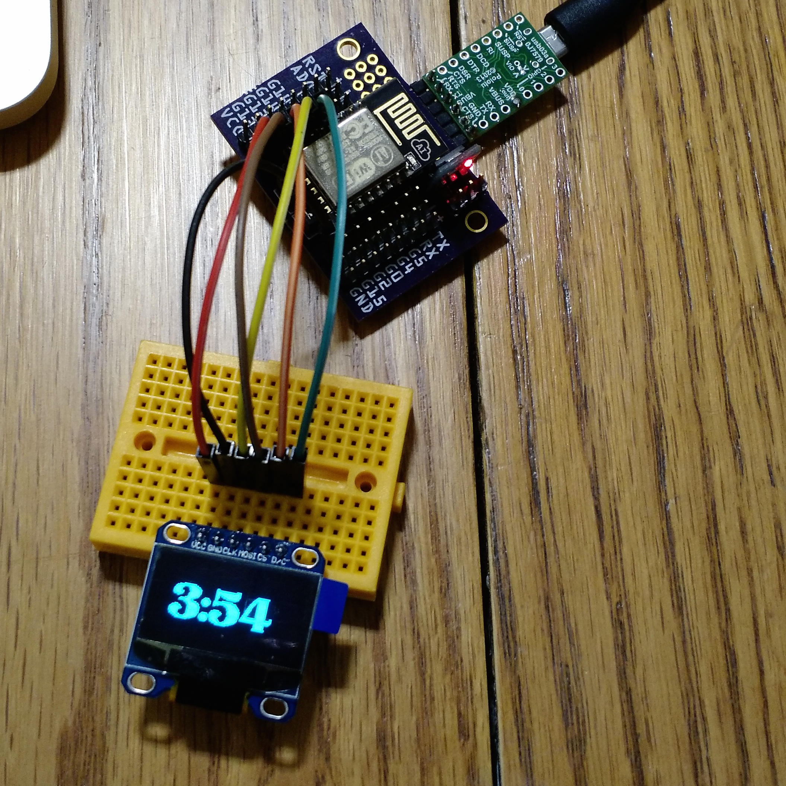

# Visual Timer

## for the SSD1306 OLED on the ESP8266

## Pinout

SPI pinout for 128x64 OLEDs is wired as follows:

| ESP8266 Pin | OLED Pin  |
| ----------- | --------- |
| GPIO14      | CLK / SCLK / D0|
| GPIO13      | MOSI / D1 |
| GPIO4       | RESET     |
| GPIO16      | D/C       |
| GPIO12      | CS        |
